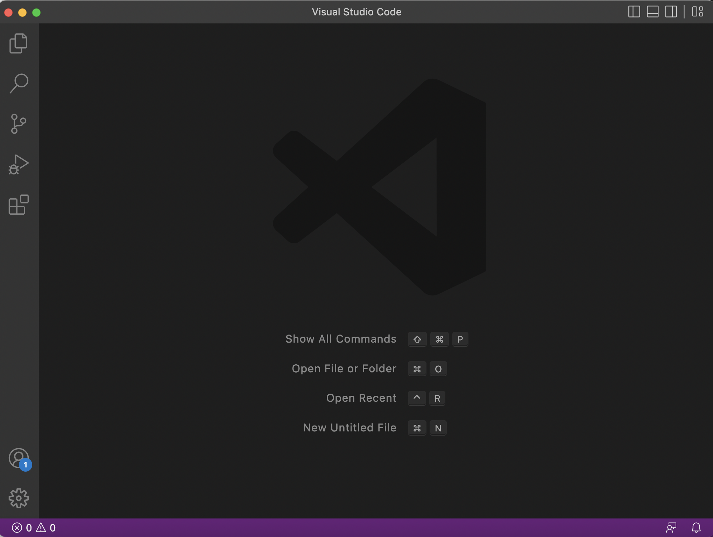
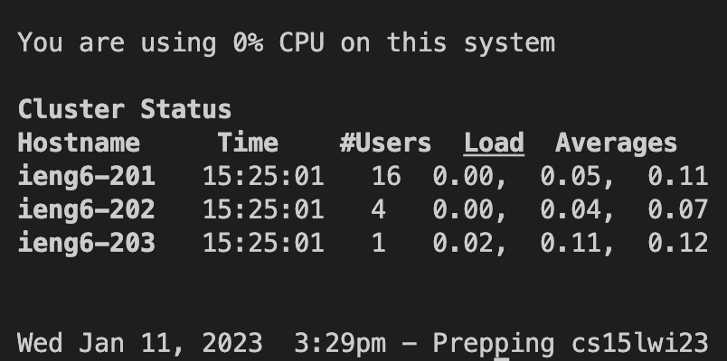
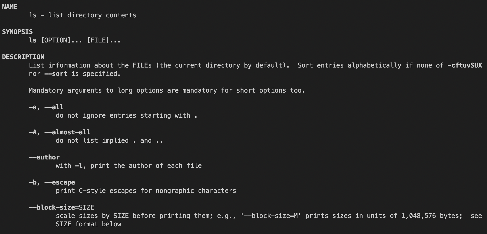
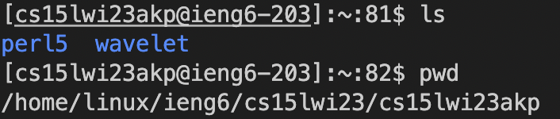
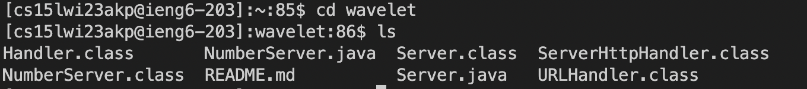

# Tutorial for Account Remote Accesss

## Step 1: Installing Visual Studio Code

The first step to remotely accessing your course specific **ieng** account is to install Visual Studio Code (VSCode).  

Visit the VSCode [website](https://code.visualstudio.com/Download) for information on the installation process. 
Make sure you download the correct application for your operating system.

After installing VSCode, open it, the application should look similar to the image below.

**NOTE** Users on Windows will need to install Git in order to go to the next step. Git can be installed using this [website](https://gitforwindows.org),
and follow the steps [here](https://stackoverflow.com/questions/42606837/how-do-i-use-bash-on-windows-from-the-visual-studio-code-integrated-terminal/50527994#50527994) to set up Git properly with VSCode on your PC.
 

## Step 2: Remotely Connecting Using Your Course Specific Account

In order to find your course specific username go to UCSD's ETS [website](https://sdacs.ucsd.edu/~icc/index.php) and log in.

Your course specific username for CSE15L should look something like **cs15lwi23xxx**, except with different letters replacing the x's which are unique 
to your account. You may need to reset your password for this account if this is your first time logging in.

After obtaining your username, open up terminal in VSCode by going to  Terminal → New Terminal in the menu. Then enter this into the terminal
`ssh cs15lwi23xxx@ieng6.ucsd.edu`, again replacing the x's with your specific letters, and hit enter. If this is your first time logging in, you will be asked to authenticate the system, make sure to enter `yes`. You will then be prompted to enter your account password in the terminal, do so and hit enter. If the password is correct your terminal should look similar to this, and you are now logged into a computer!

## Step 3: Run Some Commands in the Terminal

Now that you are logged in, here are a few basic commands to try out: `cd`, `ls`, `pwd`, `mkdir`, and `cp`. Enter these commands into the terminal and see what they do. You can also use the  `help` and manual `man` comands to explore and learn more about the terminal.

Here is the some of the manual for the list command found by entering `man ls`

As you can see, the manual can be very useful in learning more about what a command does.

The `pwd` commant prints the name of the current directory. Then use the `ls` command to list all the contents in the current directory.

In this case there were two files in my current working directory: per15 & wavelet.

Then use the `cd` command followed a file name to change the working directory to that  file. For example, from this working directory the command `cd wavelet` will change the working directory to be inside the wavelet folder.

Here you can see all the files within wavelet, which is now the new working directory

Have fun exploring the commands in the terminal! When you are finished type `exit` to disconnect from the computer.

