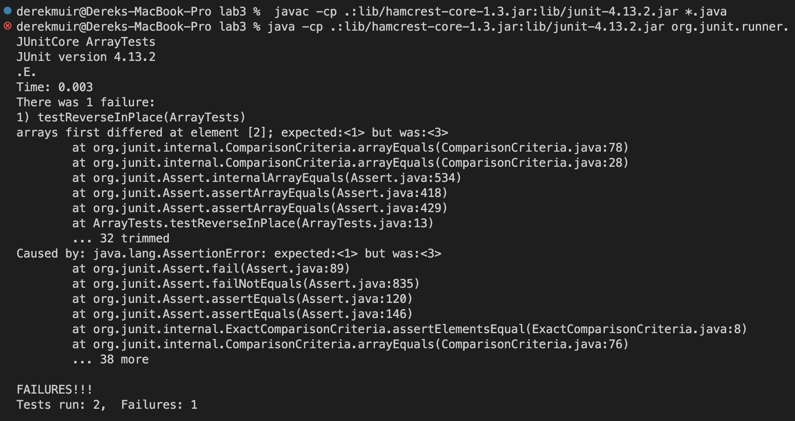
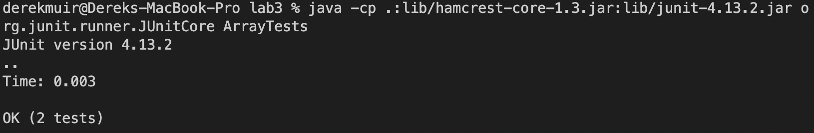

# Part 1 - String Server
  Here is the code for the StringServer.java program which displays a string that is continuously incremented through a URL query
  
 ``` 
import java.io.IOException;
import java.net.URI;

class Handler implements URLHandler {
    String strings = "";

    public String handleRequest(URI url) {
        if (url.getPath().equals("/add-message")) {
            if (url.getQuery().contains("=") == false) {
                return "Invalid Query";
            }
            String[] parameters = url.getQuery().split("=");
            if (parameters[0].equals("s")) {
                strings += parameters[1] + "\n";
                return strings;
            }
            else {
                return "Invalid Query";
            }
        }
        else { 
            return "404 Not Found!";
        }
    }
}


class StringServer {
    public static void main(String[] args) throws IOException {
        if(args.length == 0){
            System.out.println("Missing port number! Try any number between 1024 to 49151");
            return;
        }

        int port = Integer.parseInt(args[0]);

        Server.start(port, new Handler());
    }
}
```

Here is the output for the url `localhost:4000/add-message?s=Hello`

The code first checks that the path contains `/add-message` and that the query is in the format `?s=<String>`. Afterwards, the String array
`parameters`has its 1st index set to `"Hello"`. Then, the String `strings` is concatonated with `parameters[1]` and `"\n"` to add a new line to the string.

Next, after the url `localhost:4000/add-message?s=Goodbye` is executed, the page is updated to the following.

Again, the code checks for the correct path and query, and then assigns `Goodbye` to the first index of the String array `parameters`. Then, 
`parameters[1]` is concatonated with the String `strings` in the return statement. 

# Part 2 - Debugging ArrayExamples.java

The class ArrayExamples.java has a method, `reverseInPlace(int[] arr)`, that takes as input a Integer array and then reverses the order of elements in that same array. Here is the original code for the funciton:
```
// Changes the input array to be in reversed order
  static void reverseInPlace(int[] arr) {
    for(int i = 0; i < arr.length; i += 1) {
      arr[i] = arr[arr.length - i - 1];
    }
  }
  ```
  

However, the original fucntion has several bugs many resulting symptoms. Using a JUnit test we can show this method has the failure inducing input of
{1, 2, 3}. The desired Output is {3, 2, 1}, but the array is changed to {1, 2, 1}. Here is the code for the JUnit test for the failure inducing input:
```
public void testReverseInPlace() {
    int[] input2 = {1,2,3};
    ArrayExamples.reverseInPlace(input2);
    assertArrayEquals(input2, new int[]{1,2,3});
}
  ```


Even thought the program has a bug, not all inputs result in symptoms. For example, symmetrical or black arrays do not result in failures. The input
{0, 0, 0} does not result in an error even thought the program contains a bug.
```
public void testReverseInPlace() {
    int[] input1 = { 3 };
    ArrayExamples.reverseInPlace(input1);
    assertArrayEquals(new int[]{ 3 }, input1);
}
  ```
After running both of these inputs as JUnit tests, it is clear that the Integer Array {1, 2, 3} results in a symptom but {0, 0, 0} works as intended.


The bug  is that the code attempts to iterate through the array, and replace the element at the beginning of the array with its respective
opposite element at the end of the array. This strategy however results in the second half of the array elements being replaced by the first half
in reverse order.

The new code only iterates through half of the array, and replaces the opposite element on the back half of the array with its mirror in the
front half. Here is the new method with the bug fixed:
```
static void reverseInPlace(int[] arr) {
    int front, back;
    for (int i = 0; i < arr.length / 2; i++) {
      front = arr[i];
      back = arr[arr.length - 1 -i];
      arr[i] = back;
      arr[arr.length - 1 - i] = front;
    }
  }
```


# Part 3 - What I Learned

In Lab 3 I learned how to use JUnit, a java testing framework, to effectively test my code against expected inputs and fringe cases. Althought fully
testing your code against all inputs is impossible, writing JUnit tests beforehand will ensure that you code is working as intended for most inputs.
The advantage of using JUnit over manually testing your code is you can prewrite JUnit tests, and then test them against funcitons as you implement
them. This allows you to code more efficiently and effectively. I also learned that just because your code is passing all your tests doesn't mean
it doesn't contain any bugs. Therefore, designing test cases correctly and thoughfully is an important programming skill.
