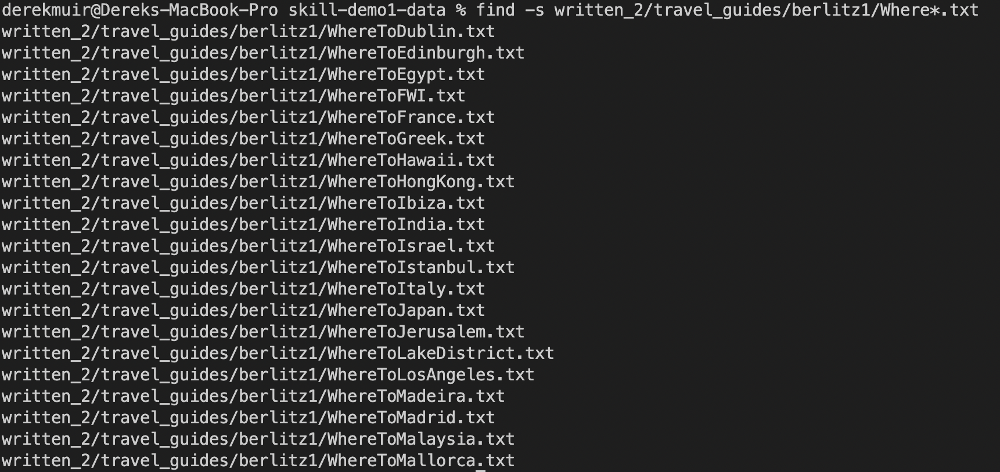

# Lab 3

The `find` utility is a useful terminal command for finding files that fit a certain description within a directory. It operates by evaluating every path in a given directory against an expression and printing the results. There are many additional options to be used with `find` that can be very useful. The format of using the command is `find [path...] [expresssion]`. Here are four examples of using `find` in different ways on the [/written-2](https://github.com/ucsd-cse15l-w23/skill-demo1-data.git) directory. 

Sources Used:[GNU Documentation](https://www.gnu.org/software/findutils/manual/html_mono/find.html), [find Manual](https://man7.org/linux/man-pages/man1/find.1.html)

## 1: The -name primary

The most useful option for `find` is likely `-name <pattern>` which evaluates the last compenent of given path name against the given pattern. 
You can also use special characters such as `?` and `*` in the pattern.

### Example: Finding path names containing "Italy"

In this example the pattern is `*Italy*.txt` meaning that any path containing "Italy" should be returned by our command. The astericks are wildcard 
characters that can represent zero or many different characters of any type.

### Example: Finding non .txt path names

In this example the addition of `\!` before the file path represents the logical NOT operator. Meaning that find will return true for cases where the 
given expression was evaluated to false. In this case the pattern was any path containing `*.txt`, therefore the paths returned by find do not contian 
".txt"

## 2: The -s option

The  `-s` option allows you quicklky sort the given files alphabetically within each directory.

### Example: Searching through berlitz1 alphabetically

In this example we search through all the paths in berlitz1 directory alphabetically. This could be useful if you want to browse through paths in a 
directory in an ordered fashion.

Similarly, we can sort the non-fiction paths within written-2 using`-s`.

## 3: The -depth n primary

The `-depth n` primary allows you to evaluate files that are a given depth n from the given directory.

### Example: Finding paths with a depth of 4

In this example we used the `-depth 4` primary to evaluate our paths against a depth or distance of 4 from the given directory. 
Although all the outputs aren't included in the image, a depth of 4 excludes all the travel guides from our search because they only have a depth of 3.

### Example: Finding paths with a depth of 5

In th same `written-2` directoy we can use  `-depth 5` to look for files that have a depth of 5. As we can see, there are no files within the directory 
that have a depth of 5.

## 4: The -newer primary

Oftentimes it might be useful to look for the newest files in a directory. The `-newer <file>` primary allows us to the age of files against the given
file, and returns them if they are newer than the given file.

### Example: Finding files newer than "HistoryItaly.txt"

Here I have searched for files within the directory that are newer than `HistoryItaly.txt`. Noticably, all of the nonfiction files seem to have been 
made prior to the file in question.

### Example: Finding files newere than "HistoryItaly.txt" and containing "History" in their name

A cool thing about the `find` command are the logical operators you can add onto your expressions. In this example I used the `-and` logical expression
in combination with the last example to search for files newer than `HistoryItaly.txt` that also contain `*History*` in their name.
